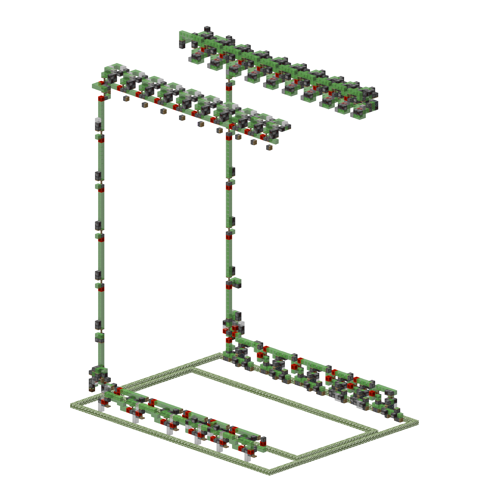

# CCWE Tiling
A small program for tiling the cart-coral-less world eater by `_spindle_` and `Aqkrm`. The eater is compatible with minecraft `1.13+`.

# Installation
The easiest way is to [download](https://github.com/EQUENOS-2/CCWE-Tiling/releases/download/v1.0/CCWE_maker.exe) an executable file from releases.

If you have [Python](https://www.python.org/downloads/), you can install the `litemapy` library by running `pip install litemapy` in the console. After that you'll be able to run the `.py` file directly.

# Usage
The usage is very straightforward. The program creates a `.litematic` file in the same directory it is locaed in. For that reason it is convenient to drag the script into your `schematics` folder, or maybe even into a subfolder like `schematics/CCWE` for the sake of organising.

